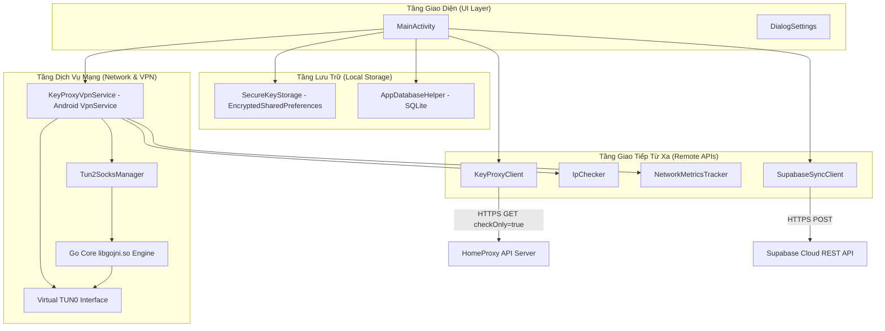

# DEVELOPMENT GUIDE — HOANQSON PROXY

Tài liệu này cung cấp hướng dẫn tổng thể về kiến trúc hệ thống, các luồng dữ liệu chính và nhiệm vụ của từng file mã nguồn dành cho lập trình viên hoặc AI Agent tiếp nhận dự án.

---

## 1. Kiến trúc hệ thống thực tế

Dự án tuân theo mô hình phân tầng module hóa, tách biệt rõ ràng giữa giao diện người dùng, dịch vụ mạng nền tảng VPN và các API client giao tiếp từ xa.

---

## 2. Các luồng xử lý chính (Core Workflows)

### Luồng 1: Xác thực và lưu Key
1. Người dùng nhập key vào `MainActivity` (hoặc mở hộp thoại Cài đặt).
2. `MainActivity` gọi `KeyProxyClient.getCurrentProxy(key)`.
3. `KeyProxyClient` gửi request: `https://app.homeproxy.vn/api/v3/users/rotatev2?token={key}&checkOnly=true`.
   *(Lưu ý: `checkOnly=true` là cờ quan trọng nhất để không tiêu tốn lượt xoay proxy).*
4. Nếu kết quả thành công:
   - Lưu key vào `SecureKeyStorage` (mã hóa Keystore).
   - Lưu hoặc cập nhật record vào `AppDatabaseHelper` (SQLite).
   - Bất đồng bộ gọi `SupabaseSyncClient.submitValidKey(key)` gửi key lên Cloud.
5. Nếu kết quả thất bại (key hết hạn / sai token): Báo lỗi cho người dùng, tuyệt đối **không** lưu local và **không** gửi Supabase.

### Luồng 2: Kết nối VPN & Định tuyến Tun2Socks
1. Người dùng nhấn nút **KẾT NỐI (CONNECT)**.
2. `MainActivity` gửi Intent khởi chạy `KeyProxyVpnService`.
3. `KeyProxyVpnService` tạo virtual TUN interface với địa chỉ IP `10.0.0.2/24` và DNS `1.1.1.1`.
4. `Tun2SocksManager` nhận File Descriptor của TUN interface và chuỗi cấu hình proxy, gọi lệnh native `engine.Engine.start()`.
5. Toàn bộ lưu lượng TCP/UDP của thiết bị chuyển hướng qua cổng proxy cục bộ.
6. `IpChecker` thực hiện truy vấn IP để xác nhận tunnel hoạt động và hiển thị IP công khai mới.
7. `NetworkMetricsTracker` bắt đầu chu kỳ đo Ping, Download speed, Upload speed thực tế.

### Luồng 3: Xoay IP (Rotate Proxy) & Tự động xoay (Auto Rotate)
1. Người dùng bấm **XOAY PROXY (ROTATE)** hoặc Timer tự động kích hoạt.
2. `KeyProxyClient.rotateProxy(key)` gửi request không có cờ `checkOnly`: `https://app.homeproxy.vn/api/v3/users/rotatev2?token={key}`.
3. Nếu server trả về proxy mới:
   - Cập nhật thông tin proxy vào `Tun2SocksManager`.
   - Ghi nhật ký vào bảng `rotation_history` trong SQLite.
   - Cập nhật giao diện mốc thời gian xoay gần nhất.
4. Nếu server trả về cooldown (`timeRemaining > 0`):
   - Giữ nguyên kết nối proxy cũ đang chạy, không ngắt mạng của người dùng.
   - Hiển thị thời gian đếm ngược còn lại.

---

## 3. Bản đồ các file mã nguồn quan trọng (Key Files Map)

| Đường dẫn file | Nhiệm vụ chính |
| :--- | :--- |
| `app/src/main/java/vn/homeproxy/keyrotator/MainActivity.kt` | Điều khiển giao diện chính, lắng nghe sự kiện, gắn kết với VpnService, hiển thị trạng thái kết nối và quản lý dialog cài đặt. |
| `app/src/main/java/vn/homeproxy/keyrotator/proxy/KeyProxyClient.kt` | Giao tiếp với API của HomeProxy. Xử lý logic check current proxy (`checkOnly=true`) và rotate proxy. |
| `app/src/main/java/vn/homeproxy/keyrotator/net/SupabaseSyncClient.kt` | Giao tiếp với Supabase REST API (PostgREST), gửi key hợp lệ lên bảng `api_key_logs`, xử lý mã `201 Created` và `409 Conflict`. |
| `app/src/main/java/vn/homeproxy/keyrotator/storage/SecureKeyStorage.kt` | Quản lý lưu trữ bảo mật key, token và cấu hình bằng `EncryptedSharedPreferences` qua Android Keystore. |
| `app/src/main/java/vn/homeproxy/keyrotator/database/AppDatabaseHelper.kt` | SQLite OpenHelper quản lý bảng `proxy_keys` (lưu danh sách key) và `rotation_history` (lịch sử xoay). |
| `app/src/main/java/vn/homeproxy/keyrotator/vpn/KeyProxyVpnService.kt` | Android Foreground Service kiểu `specialUse (vpn)`, tạo TUN interface và kiểm soát toàn bộ vòng đời VPN. |
| `app/src/main/java/vn/homeproxy/keyrotator/vpn/Tun2SocksManager.kt` | Cầu nối JNI với lõi Go `tun2socks` (`engine.Engine`), cấu hình routing và quản lý khởi động/dừng engine. |
| `app/src/main/java/vn/homeproxy/keyrotator/proxy/IpChecker.kt` | Kiểm tra IP công khai qua các dịch vụ như `api.ipify.org` khi kết nối proxy thành công. |
| `app/src/main/java/vn/homeproxy/keyrotator/net/NetworkMetricsTracker.kt` | Đo đạc latency (ping socket thực) và tốc độ tải xuống/tải lên thực tế qua đường truyền. |
| `app/src/main/java/vn/homeproxy/keyrotator/util/AppLogger.kt` | Logger an toàn, tự động che mờ (masking) token/password và tự động tắt log debug trên bản Release. |
| `app/libs/tun2socks.aar` | Thư viện nhị phân Android Archive chứa các native libraries `.so` của Go netstack. |

---

## 4. Hướng dẫn thêm tính năng mới an toàn

1. **Tuyệt đối không đổi package name**: `vn.homeproxy.keyrotator` đã gắn liền với cấu hình manifest và signing.
2. **Không sửa param của API HomeProxy**: Cờ `checkOnly=true` là bắt buộc khi chỉ kiểm tra key.
3. **Giữ nguyên cấu hình JNI**: Không sửa đổi `useLegacyPackaging = true` và `extractNativeLibs = true` trong gradle/manifest để tránh lỗi phân tích cú pháp gói trên Android 14.
4. **Kiểm tra R8 khi thêm class mới**: Bất kỳ model nào parse JSON qua Gson cần được khai báo keep rule trong `proguard-rules.pro`.
